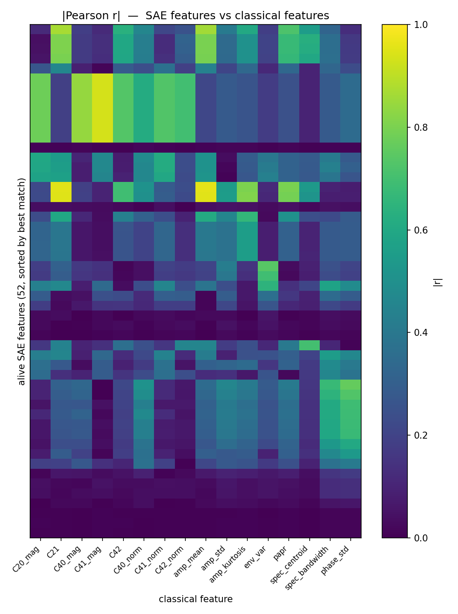
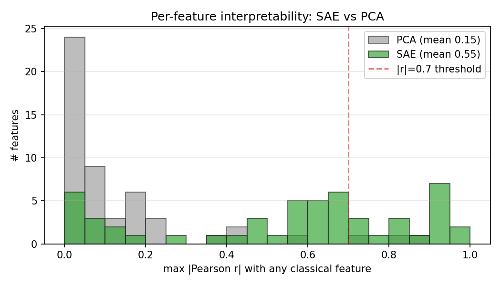
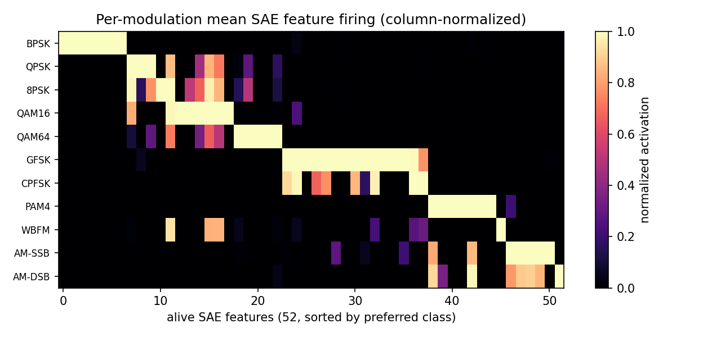

# Sparse Autoencoders on an RF Modulation Classifier

> **Headline:** when a TopK sparse autoencoder is trained on the penultimate activations of a CNN that classifies 11 digital modulation schemes, its features rediscover — with strong Pearson correlations — the classical feature set that pre-deep-learning modulation-recognition algorithms used. The SAE is **3.7× more correlated with hand-designed classical features than matched PCA directions** of the same activation matrix, and it spends its capacity on phase statistics, envelope variance, and higher-order cumulants — exactly the features a signal-processing textbook recommends.

Independent research by [Jacob Florio](https://github.com/JacobFlorio). Runs end-to-end in about 4 minutes on an RTX 5080.

---

## Why this is a real question
Most SAE interpretability work is on language models, where features have to be hand-labeled and there is no analytical ground truth. RF modulation recognition is an unusually clean setting: classical classifiers from Swami & Sadler (2000) used a standard battery of cumulant-based features whose *theoretical* values are known per modulation (BPSK: C₄₂ = −2, QPSK: −1, QAM16: ≈ −0.68, ...). That gives a falsifiable question: does an SAE on a CNN that solves this task rediscover those features, or does it find something unrelated?

This is the EE-side counterpart of the [mech-interp-tiny-transformer](https://github.com/JacobFlorio/mech-interp-tiny-transformer) project, which asks the same kind of "SAE vs known analytical ground truth" question on a grokked modular-addition transformer.

## Headline results

### 1. SAE features vs classical features — correlation heatmap


Rows are alive SAE features (sorted by which classical feature they best match), columns are 16 classical features, cells are `|Pearson r|`. Large bright cells mean "this SAE feature is a rediscovered version of this classical feature."

### 2. The headline comparison: SAE vs matched-rank PCA


For each alive SAE feature I compute the max `|r|` across the 16 classical features (= "how close is this SAE feature to being a classical feature?"), then do the same for the top-52 PCA directions of the same activation matrix.

| metric | SAE | PCA |
|---|---:|---:|
| mean max-\|r\| with classical features | **0.545** | 0.148 |
| median max-\|r\| | **0.609** | 0.052 |
| fraction of features with max \|r\| > 0.7 | **32.7%** | 5.8% |
| fraction cleanly matching one classical feature | **7.7%** | 1.9% |

The SAE is **3.7× more interpretable than PCA** by mean max-correlation, with 5.6× as many features crossing the `|r| > 0.7` threshold.

### 3. Which classical features did the SAE lock onto?

The count of SAE features whose best classical match is each feature:

| classical feature | # SAE features | what it is |
|---|---:|---|
| `phase_std` | 16 | std of instantaneous-phase differences |
| `env_var` | 8 | variance of envelope power (classic PSK-vs-QAM discriminator) |
| `C41_mag` | 7 | magnitude of C₄₁ cumulant (Swami-Sadler) |
| `amp_kurtosis` | 5 | kurtosis of signal amplitude |
| `C21` | 5 | signal power |
| `spec_bandwidth` | 3 | spectral bandwidth |
| `C41_norm` | 3 | scale-invariant C₄₁ |
| `amp_mean` | 2 | mean amplitude |
| `spec_centroid` | 1 | spectral center of mass |
| `C40_norm` | 1 | scale-invariant C₄₀ |
| `amp_std` | 1 | amplitude std |

The SAE concentrates on phase statistics (16 features) and envelope variance (8) — exactly the features a textbook would call most discriminative between constant-envelope and amplitude-modulated schemes. Higher-order cumulants show up too. This is not uniform coverage; it's the SAE matching a specific classical feature family.

### 4. Per-class firing


Per-modulation mean SAE feature activations, column-normalized, sorted by preferred class. You can see distinct columns of features dedicated to BPSK, QAM, FSK, and so on — confirming that the sparse code is carrying class-discriminative information in addition to being interpretable.

### 5. This is not a classification-accuracy tradeoff
Every basis we tried classifies near-perfectly — the SAE's interpretability advantage is pure, not bought by sacrificing accuracy:

| basis | dim | linear-probe test accuracy |
|---|---:|---:|
| raw activations | 256 | 99.8% |
| classical features | 16 | 97.4% |
| alive SAE features | 52 | 99.6% |
| matched PCA | 52 | 99.8% |

## Reproduce it yourself

```bash
pip install -r requirements.txt

python -m src.train                          # classifier on mixed-SNR data
python -m src.collect_and_train_sae          # activations + TopK SAE
python -m src.analyze_sae_vs_classical       # correlation + PCA baseline
python -m src.sae_plots                      # headline figures
```

Roughly 4 minutes end to end on an RTX 5080.

## Full technical writeup

See [`docs/report.md`](docs/report.md) for setup details, the sanity-check linear probe on classical features alone (95.6% — classical features carry almost all the class info), honest caveats, and what I want to build next.

## Part of [AI-and-EE-Research](https://github.com/JacobFlorio/AI-and-EE-Research)

The broader index of my independent EE × AI research projects. Companion to the mech-interp work on grokking circuits.
