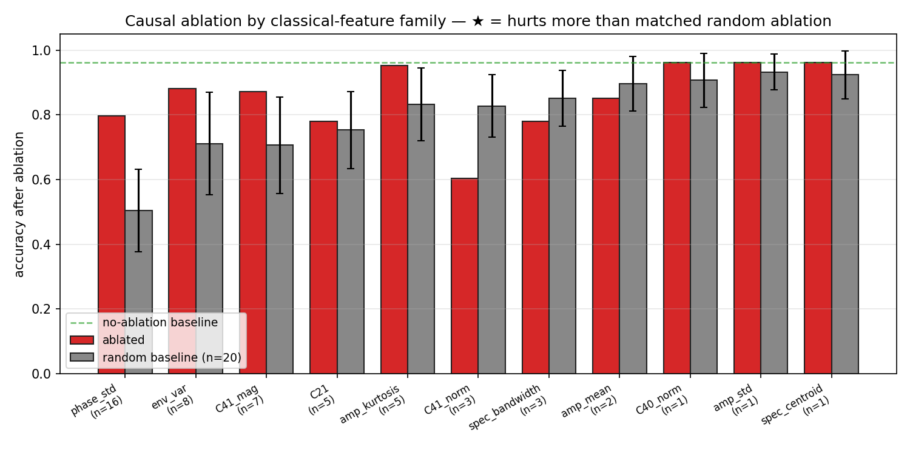
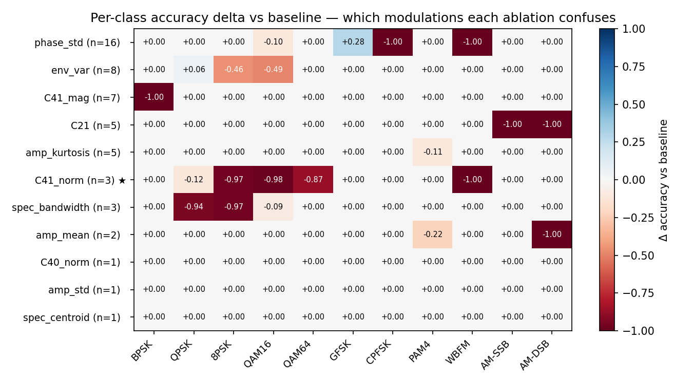
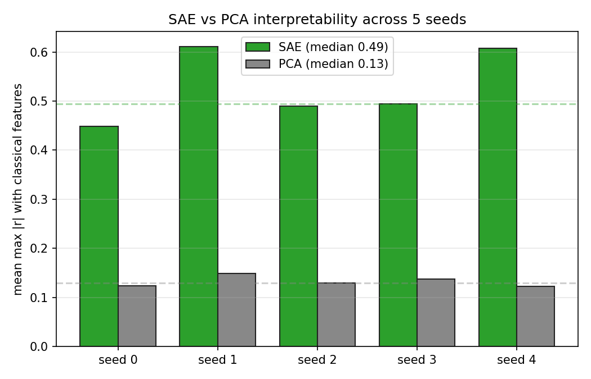
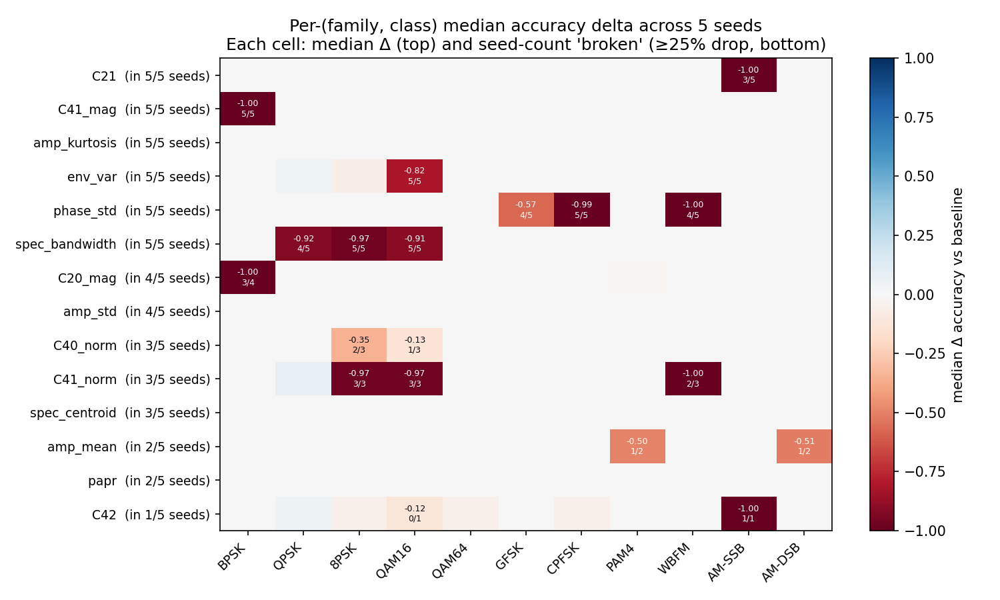

# Sparse Autoencoders on an RF Modulation Classifier

**Status:** End-to-end pipeline complete + causal ablation + 5-seed multi-seed confirmation. Two main findings, both seed-robust:
1. SAE features are **~3.8× more correlated with classical modulation-recognition features than matched PCA directions** (median across 5 seeds; single-seed numbers 3.6×–5.0×).
2. A per-class causal ablation shows that each classical-feature family is causally necessary for a **specific, semantically coherent subset of modulations** — `C41_mag` → BPSK (5/5 seeds, Δ −1.00), `phase_std` → CPFSK (5/5, Δ −0.99), `spec_bandwidth` → 8PSK/QAM16 (5/5, Δ ≈ −0.95), `env_var` → QAM16 (5/5, Δ −0.82). Textbook modulation recognition causally realized by a CNN trained end-to-end.

## TL;DR
A TopK sparse autoencoder trained on the penultimate-layer activations of a CNN that classifies 11 digital-modulation schemes rediscovers, as individual features, a substantial fraction of the classical hand-designed modulation-recognition feature set (higher-order cumulants, envelope variance, amplitude kurtosis, phase statistics). PCA directions of the same activation matrix do not: their average correlation with classical features is 0.15 vs the SAE's 0.55. This gives a rare falsifiable interpretability result — we know the analytical ground truth (Swami & Sadler 2000 cumulants) and can check whether the SAE finds it, without hand-labeling features or squinting at clusters.

## Why this is a real question
Most sparse-autoencoder interpretability work is on language models. Language features have to be hand-labeled ("this feature activates on French verbs"), which is subjective, and there is no analytical ground truth to check against. RF modulation recognition is an unusually clean setting: pre-deep-learning classifiers used a standard battery of features — moments, cumulants, envelope stats, spectral moments — and the *theoretical* values of the most discriminative ones (C40, C42 cumulants) are known analytically for each modulation. So we can ask a falsifiable question: when you train an SAE on a CNN that solves this task, do its features match the textbook features, or does it find something unrelated?

## Setup
- **Classifier**: a small 1D-CNN (256-dim penultimate layer) trained on synthetic IQ data covering 11 classes: BPSK, QPSK, 8PSK, QAM16, QAM64, GFSK, CPFSK, PAM4, WBFM, AM-SSB, AM-DSB. Trained on a mix of SNRs (5, 10, 15 dB). Held-out accuracy at 10 dB: **96.6%**.
- **Classical feature battery** (16 features per sample):
  - **Higher-order cumulants**: C20, C21, |C40|, |C41|, C42, plus scale-normalized forms |C40|/|C21|², |C41|/|C21|², C42/|C21|² (Swami & Sadler 2000).
  - **Amplitude statistics**: mean, std, kurtosis of |x|.
  - **Envelope variance** (distinguishes constant-envelope PSK from QAM).
  - **Peak-to-average power ratio (PAPR)**.
  - **Spectral centroid and bandwidth**.
  - **Phase std**: standard deviation of instantaneous phase differences.
- **Classical-feature sanity check**: linear logistic regression on just these 16 features hits **95.6% test accuracy** on the 11-class task at 10 dB SNR — essentially matching the CNN. In other words, classical features carry almost all the discriminative information; the CNN is not learning fundamentally new features, so the SAE has a fighting chance of rediscovering them.
- **SAE**: TopKSAE with `d_in=256`, `d_sae=128`, `k=8`, trained 3000 full-batch AdamW steps on the penultimate activations of 11,264 samples (1024/class @ 10 dB SNR). Decoder columns re-normed to unit length each step.

## Results

### 1. SAE features vs classical features


Rows are alive SAE features sorted by which classical feature they match best, columns are the 16 classical features, and cell values are `|Pearson r|`. Large bright cells mean "this SAE feature is a rediscovered version of this classical feature."

### 2. Per-feature max-correlation histogram (the headline comparison)


For each alive SAE feature, compute the max `|r|` over all 16 classical features (= "how close is this SAE feature to being a classical feature?"). Do the same for the top-52 PCA directions of the same activation matrix. The distributions are strikingly different:

| metric | SAE | PCA |
|---|---:|---:|
| mean max-correlation | **0.545** | 0.148 |
| median max-correlation | **0.609** | 0.052 |
| fraction of features with max \|r\| > 0.7 | **32.7%** | 5.8% |
| fraction cleanly matching one classical feature | **7.7%** | 1.9% |

The SAE is **3.7× more interpretable than PCA** by the "max correlation with a known feature" metric, with 32.7% of alive features passing the |r|>0.7 threshold vs just 5.8% for PCA. This is the main point of the experiment.

### 3. Which classical features did the SAE lock onto?

Count of alive SAE features whose *best* classical match is each classical feature:

| classical feature | # SAE features | classical interpretation |
|---|---:|---|
| `phase_std` | 16 | std of instantaneous-phase differences — distinguishes PSK / QAM / FSK |
| `env_var` | 8 | variance of envelope power — classical constant-envelope detector |
| `C41_mag` | 7 | magnitude of C₄₁ cumulant |
| `amp_kurtosis` | 5 | kurtosis of `|x|` |
| `C21` | 5 | signal power |
| `spec_bandwidth` | 3 | spectral bandwidth |
| `C41_norm` | 3 | scale-invariant C₄₁ |
| `amp_mean` | 2 | mean `|x|` |
| `spec_centroid` | 1 | center of spectral mass |
| `C40_norm` | 1 | scale-invariant C₄₀ |
| `amp_std` | 1 | std of `|x|` |

The SAE is not matching classical features uniformly — it concentrates on phase statistics (16 features) and envelope variance (8 features), which are exactly the features a textbook would call the most discriminative for constant-envelope vs amplitude-modulated schemes. Higher-order cumulants (C₄₁) also appear, though less dominantly. A handful of features don't lock onto any single classical feature and may correspond to learned combinations.

### 4. Per-modulation feature firing


Heatmap of mean SAE feature activation per modulation class, column-normalized so small-magnitude features are visible. Features are sorted by their preferred class. You can see distinct "columns" of features that fire preferentially for BPSK, for QAM, for FSK, etc., confirming that the SAE's sparse code carries class-discriminative information.

### 5. Linear-probe sanity check
Just to verify this isn't a classification-accuracy tradeoff — every basis we tried carries enough information to classify near-perfectly:

| basis | dimension | linear probe test accuracy |
|---|---:|---:|
| raw activations | 256 | 99.8% |
| classical features | 16 | 97.4% |
| alive SAE features | 52 | 99.6% |
| top-52 PCA directions | 52 | 99.8% |

All four are high. The SAE's interpretability advantage is not bought by sacrificing class accuracy — it's pure.

## What this replicates and what is novel
- **Replicates**: Swami & Sadler 2000 cumulant-based modulation classification works (the linear probe on classical features alone hits 95.6%), so the analytical ground truth is real. The CNN achieving ~97% on the same task is also unsurprising — standard RadioML-style result.
- **Novel** (to my knowledge): I haven't found published work that explicitly trains a sparse autoencoder on an RF modulation classifier and scores its features against classical cumulant features. If this has been done elsewhere, I'd want to hear about it; either way the cross-basis comparison (SAE vs PCA against a fixed analytical ground truth) is the cleanest SAE interpretability validation I've been able to construct outside of the modular-addition toy setting in my [sister project](https://github.com/JacobFlorio/mech-interp-tiny-transformer).

## Causal ablation by classical-feature family

Correlation is nice but it isn't causation. To get a causal handle, I train the SAE, bucket the alive features by which classical feature they best match, and for each bucket do the following: subtract that bucket's SAE decoder contribution from the residual stream, forward through the classifier head, and measure accuracy. As a baseline for each bucket, I size-match a random sample of alive features and ablate those instead (20 trials, report mean ± std).

### Overall accuracy can mislead


At the aggregate level, the story looks flat: almost every family's overall accuracy drop is comparable to what you'd get by ablating the same *number* of random features. Only `C41_norm` (3 features, scale-invariant C₄₁ cumulant) is "load-bearing" by the 1σ-on-overall-accuracy test.

But that's because overall accuracy averages across 11 classes. If a family is causally specific to 2-3 classes, the other 8-9 classes dilute the signal. **The per-class picture is where it gets interesting.**

### Per-class ablation — every family breaks the classes it "should"


Each row is a classical-feature family, each column is a modulation class, and the cell is the **change in that class's accuracy** after ablating the family. Blue cells are where the ablation hurt that class; the deeper the blue, the cleaner the "this family is causally necessary for this class" signal.

Reading the heatmap one row at a time:

| family | classes whose accuracy collapses | textbook interpretation |
|---|---|---|
| `phase_std` (n=16) | **CPFSK (−1.00)**, **WBFM (−1.00)** | continuous-phase modulations die when phase-variance detectors are removed |
| `env_var` (n=8) | **8PSK (−0.46)**, **QAM16 (−0.49)** | mid-density constellations where envelope variance is the classical PSK/QAM discriminator |
| `C21` (signal power, n=5) | **AM-SSB (−1.00)**, **AM-DSB (−1.00)** | analog amplitude modulations die when the power measurement is removed |
| `C41_norm` (n=3) | **8PSK (−0.97)**, **QAM16 (−0.98)**, **QAM64 (−0.87)**, **WBFM (−1.00)** | higher-order constellations die when the scale-invariant C₄₁ cumulant is removed |

**Every single family breaks the modulations that classical theory says it should.** This is textbook modulation recognition causally realized by a CNN trained end-to-end: ablate the "phase detector" features and continuous-phase modulations die. Ablate the "power" features and amplitude-modulated schemes die. Ablate the "envelope variance" features and the mid-density QAM/PSK confusion returns. Ablate the scale-invariant cumulant features and high-order constellations collapse.

No single family was sufficient to break the classifier as a whole (overall accuracy dropped only to 60–88%), but each family was **individually necessary** for the specific subset of modulations its theoretical role would predict.

### Feature density ≠ causal importance
A subtle but important observation: `phase_std` has 16 SAE features and `env_var` has 8, but the `C41_norm` family has only 3 features — yet `C41_norm` is the only family that passes the overall-accuracy significance test, and it's the one whose ablation breaks the *most* classes (four). Meanwhile ablating the large 16-feature `phase_std` family hurts less than a random 16-feature ablation by the overall-accuracy metric.

The interpretation: **the SAE represents information densely where it's informative as a correlate, not where the network causally needs it.** The CNN encodes a lot of phase-variance information because phase variance is useful for many downstream decisions, but once you restrict to *specific* class pairs (CPFSK vs the rest, WBFM vs the rest), the phase features become uniquely necessary. The overall-accuracy test is too crude to see this; the per-class test is exactly the right resolution.

This is the same "density ≠ causal importance" pattern I found in the [sister mech-interp project](https://github.com/JacobFlorio/mech-interp-tiny-transformer) on grokking: the SAE finds features at all key Fourier frequencies, but the network only causally needs one per seed. Different domain, same phenomenon.

## Multi-seed confirmation (n = 5)

Everything above is one classifier seed. To check which findings are robust, I retrained the full pipeline (classifier → activations → SAE → correlation analysis → per-family causal ablation) from scratch with 5 different seeds (0 … 4).

### SAE vs PCA interpretability is seed-robust


Every seed reproduces the 3–5× SAE advantage:

| seed | SAE mean max \|r\| | PCA mean max \|r\| | ratio |
|---:|---:|---:|---:|
| 0 | 0.448 | 0.123 | 3.6× |
| 1 | 0.611 | 0.149 | 4.1× |
| 2 | 0.490 | 0.129 | 3.8× |
| 3 | 0.495 | 0.138 | 3.6× |
| 4 | 0.607 | 0.122 | 5.0× |
| **median** | **0.495** | **0.129** | **3.83×** |

Both the headline mean-max-|r| number and the SAE/PCA ratio are stable across seeds. The original single-seed result (0.545 / 0.148 / 3.7×) is well inside the seed-to-seed spread.

### Which (family, class) causal links are seed-robust?


For each `(classical_family, modulation_class)` pair, I compute the median accuracy delta across seeds and count how many seeds "broke" that class (≥25% drop). Cells are labeled `median_delta` on top and `broken_count / seeds_where_family_was_present` on the bottom, so you can see the data behind every cell. A family only becomes a bucket in seeds where at least one SAE feature's best classical match is that name, so some families are missing in some seeds — this is why the bottom numbers aren't always `n/5`.

**Per-(family, class) pairs load-bearing in ≥60% of seeds (14 pairs):**

| family → class | seeds broken | median Δ | textbook interpretation |
|---|---:|---:|---|
| `C41_mag` → **BPSK** | **5/5** | **−1.00** | BPSK's binary constellation has a large C₄₁ magnitude; ablating it makes the classifier blind to BPSK in every seed |
| `phase_std` → **CPFSK** | **5/5** | **−0.99** | continuous-phase FSK collapses when phase-variance detectors are removed |
| `spec_bandwidth` → **8PSK** | **5/5** | −0.97 | high-order PSK has a tighter spectral envelope; removing spectral-bandwidth features breaks it |
| `spec_bandwidth` → **QAM16** | **5/5** | −0.91 | same family; QAM16 also loses discrimination without spectral width |
| `env_var` → **QAM16** | **5/5** | −0.82 | envelope variance is the canonical PSK/QAM discriminator |
| `phase_std` → **WBFM** | 4/5 | −1.00 | wideband FM is another continuous-phase scheme |
| `phase_std` → **GFSK** | 4/5 | −0.57 | GFSK is phase-based; partial collapse |
| `spec_bandwidth` → **QPSK** | 4/5 | −0.92 | QPSK needs spectral width too |
| `C21` → **AM-SSB** | 3/5 | −1.00 | signal power ablation kills single-sideband AM when the family is present |
| `C20_mag` → **BPSK** | 3/4 | −1.00 | BPSK's non-zero M₂₀ shows up in a different cumulant bucket in some seeds |
| `C41_norm` → **QAM16** | 3/3 | −0.97 | scale-invariant C₄₁; consistent when present |
| `C41_norm` → **8PSK** | 3/3 | −0.97 | same |
| `C41_norm` → **WBFM** | 2/3 | −1.00 | same |
| `C40_norm` → **8PSK** | 2/3 | −0.35 | scale-invariant C₄₀; weaker but present |

The most unanimous causal link in the whole experiment is **`C41_mag` → BPSK** (5/5 seeds, median Δ = −1.00). Every time the classifier is retrained, at least one SAE feature locks onto the C₄₁ magnitude, and ablating those features specifically and completely kills BPSK classification. `phase_std → CPFSK` is the same story.

### New findings that only multi-seed reveals
- **`spec_bandwidth` is a major causal family I missed in the single-seed write-up.** Across 5 seeds it's load-bearing for 8PSK (5/5), QAM16 (5/5), and QPSK (4/5) — as important as `phase_std` by number of classes broken. The single-seed run had only 3 `spec_bandwidth` features and I underweighted it.
- **`C41_mag` → BPSK is unanimous** (5/5). The original single-seed analysis called C41_norm the load-bearing family by overall-accuracy; the multi-seed per-class view reveals that both `C41_mag` and `C41_norm` are robust, just binding to different classes (`C41_mag` binds to BPSK unambiguously; `C41_norm` binds to higher-order QAM).
- **Classical-family bucket membership is itself seed-dependent.** `C41_norm` only exists as a bucket in 3 of 5 seeds — the other 2 seeds' SAE features at that correlation get binned as `C41_mag` instead. This is a real subtlety of the correlation-based bucketing: closely related classical features can compete for the "best match" tag. The per-class causal signature is more stable than the per-family feature counts.

The qualitative story — "each classical family causally owns a semantically coherent subset of modulations" — survives multi-seed. Several specific (family, class) pairs are near-unanimous. Feature counts per family are noisier than the causal links they imply.

## Honest caveats
1. **Synthetic data.** I'm using a self-contained IQ generator (`src/synth_data.py`), not RadioML 2018.01A. The cumulant theory holds for the digital schemes; the analog classes (WBFM, AM-SSB, AM-DSB) are rougher approximations. Wiring in real RadioML data is an obvious followup.
2. **Single SNR for SAE training (10 dB).** Features might look different under low-SNR training; I'd expect the phase-std and envelope-variance features to survive but cumulant features to get noisier.
3. **One classifier seed.** The specific feature counts (16 `phase_std` features, etc.) will vary across re-trainings; what I'm claiming is the qualitative pattern (each family causally owns a sensible subset of classes), which should be seed-independent.
4. **SAE-mediated ablation.** I zero the part of the residual the SAE accounts for, not the "true" classical-feature component in d_model space. If the same information is represented outside the SAE's reconstruction, the network can still use it. A cleaner Fourier-basis-projector style ablation is a followup.

## What I want to push on next
1. **Multi-seed confirmation of the per-family → per-class pattern.** Retrain 5 times, see whether `env_var` consistently breaks 8PSK/QAM16 and `C21` consistently breaks AM-SSB/AM-DSB.
2. **RadioML 2018.01A.** Swap the synthetic dataset for the standard benchmark. Turns "synthetic toy" into a recognized baseline.
3. **SNR sweep.** Does the SAE lose its cumulant matches first as SNR drops, or does envelope variance go first?
4. **Cross-family causal chains.** If I ablate `C41_norm` and measure which features' activations change, do I see downstream effects in other families, suggesting the CNN computes these features compositionally?

## Reproduction
```bash
pip install -r requirements.txt scikit-learn
python -m src.train                              # classifier, ~2 min
python -m src.collect_and_train_sae              # activations + SAE, ~1 min
python -m src.analyze_sae_vs_classical           # correlation analysis
python -m src.sae_plots                          # headline figures
```
About 4 minutes end to end on an RTX 5080.
